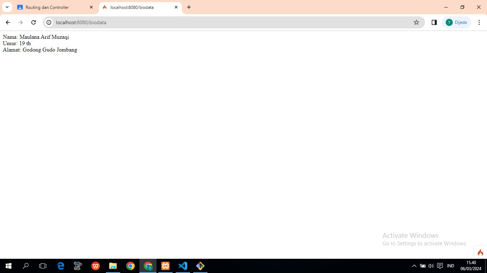
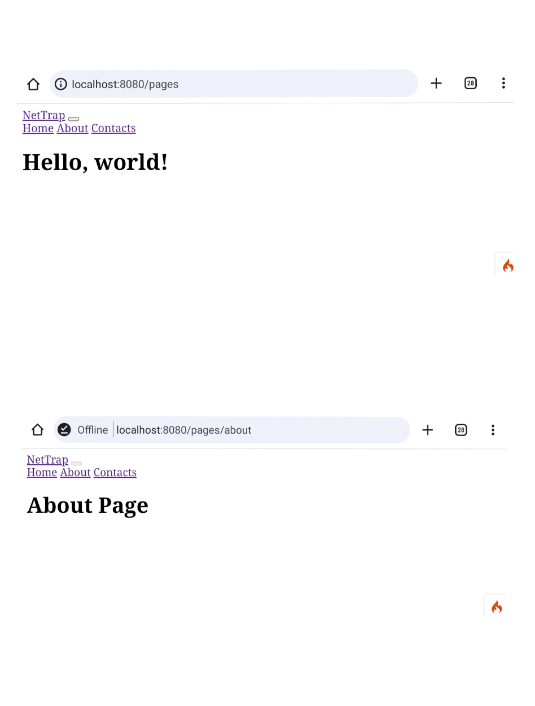
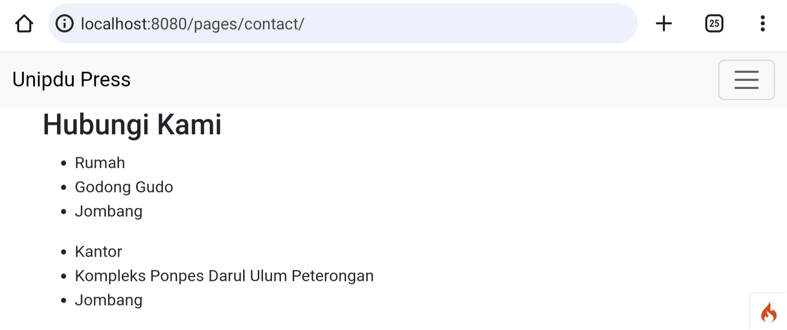
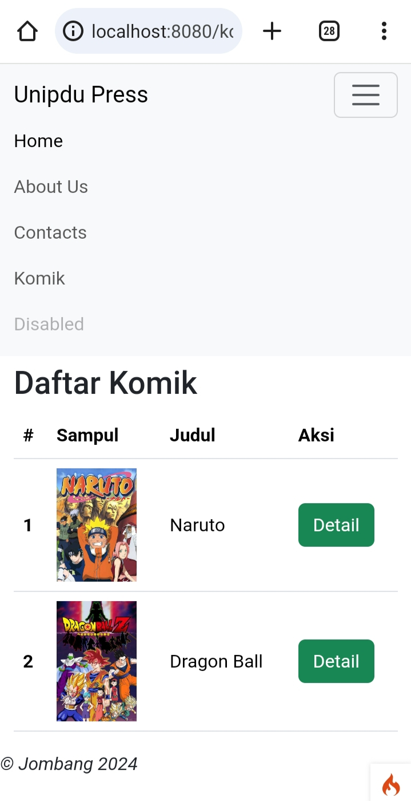
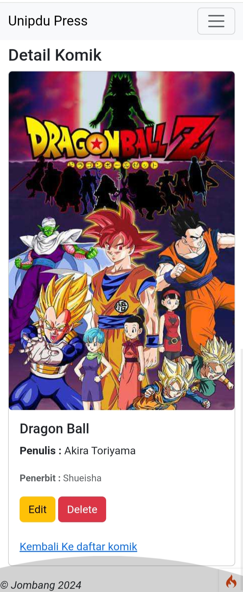
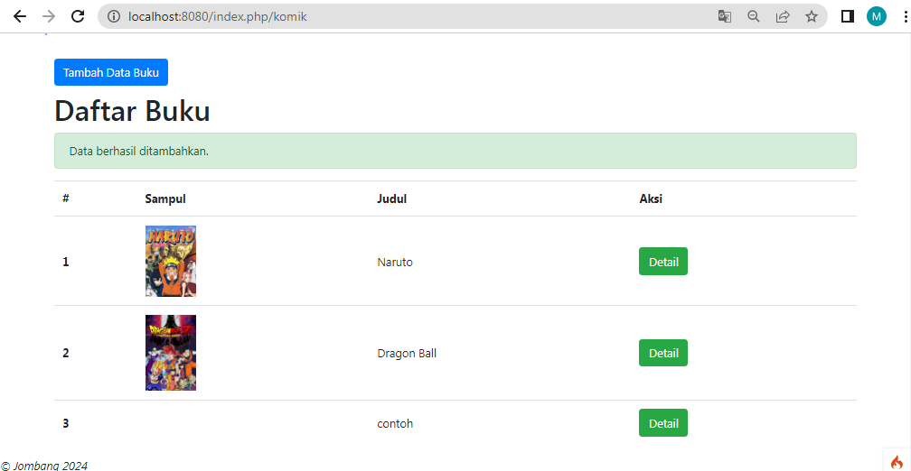
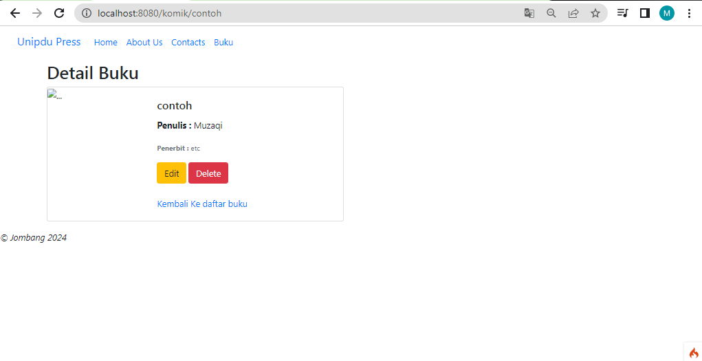
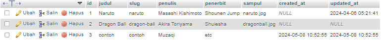
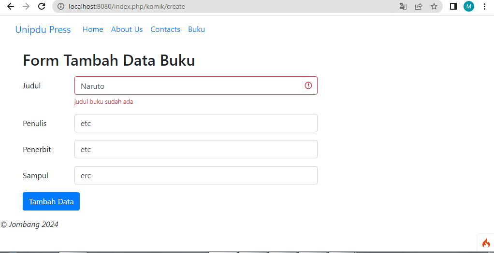
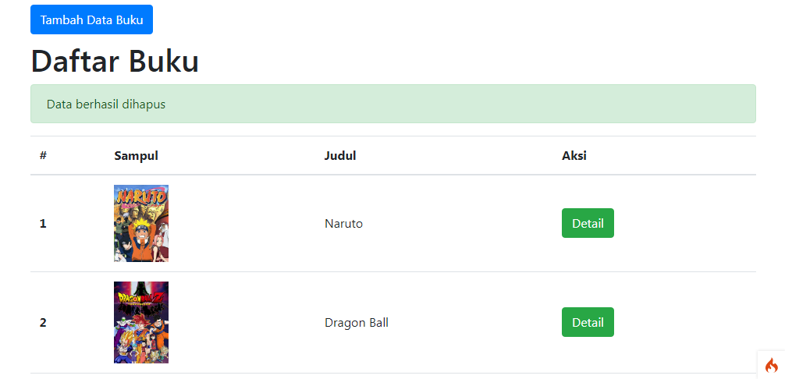

# ci4_projects

## screenshoots

- install ci4

- materi 2 biodata

- pertemuan4 View Navbar

- Hasil Tantangan contact

- Komik Model

- Detail

## insert_data

- Muncul Pesan

- Detail

- Database Otomatis Tertambah

## Validasi Data

- Jika data sudah ada

- Jika data kosong

## Delete Data
- Jika data terhapus berhasil

